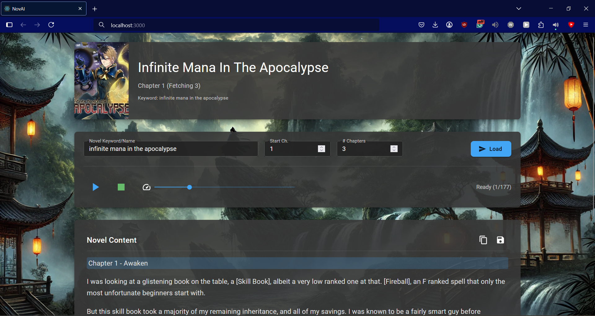

# NovAI - Novel Reader Frontend

<p align="center">
  
</p>

## Overview

NovAI Frontend is a React-based web application that provides an interactive and immersive novel reading experience. This frontend interfaces with a separate backend API to fetch novel content and provides text-to-speech capabilities, allowing users to listen to novels with real-time paragraph highlighting.

## Features

- **Interactive UI**: Clean, responsive dark-themed interface built with Material UI
- **Text-to-Speech**: Listen to novels with adjustable reading speed (0.5x to 2.5x)
- **Visual Tracking**: Real-time paragraph highlighting while reading aloud
- **Playback Controls**: Play, pause, and stop TTS functionality
- **Content Management**: Copy text to clipboard or download as TXT files
- **Responsive Design**: Optimized for various screen sizes

## Technology Stack

- **React**: Frontend library for building the user interface
- **Material UI**: Component library for consistent design and theming
- **React Hooks**: useState, useEffect, useRef, useCallback for state management
- **TTS Engine Integration**: Connects to browser's native speech synthesis capabilities
- **Fetch API**: Communication with the backend service

## Installation

1. Clone the repository:
   ```
   git clone https://github.com/Overowser/novai-frontend.git
   ```

2. Install dependencies:
   ```
   npm install
   ```

3. Start the development server:
   ```
   npm start
   ```

4. The application will be available at [http://localhost:3000](http://localhost:3000)

## Backend Requirements

This frontend application requires a backend API service that provides novel content. By default, it expects the backend to be running at `http://127.0.0.1:5000` with the following endpoint:

- `POST /api/`: Accepts JSON payload with `keyword`, `chapter`, and `number` parameters

For backend implementation details, please refer to the separate backend repository (https://github.com/Overowser/novai-backend) or the project portfolio page (https://overowser.github.io/projects/novai.html).

## Usage

1. Enter a novel keyword/name in the search field
2. Specify the starting chapter and how many chapters to fetch
3. Click the "Load" button to retrieve the content
4. Use the playback controls to listen to the content:
   - Play/Pause: Start or pause TTS reading
   - Stop: Stop reading and reset to the beginning
   - Speed slider: Adjust reading speed
5. Use the action buttons to:
   - Copy the content to clipboard
   - Download the content as a text file

## Screenshots


*Main interface with loaded novel content*

## Key Components

- **App.js**: Main application component with core functionality
- **TTS Engine Integration**: Connects to browser's native speech synthesis capabilities
- **Material UI Theme**: Custom dark theme configuration for consistent styling
- **Responsive Layout**: Grid-based layout that adapts to different screen sizes

## Customization

### Theming
The application uses Material UI's theming system, which can be easily customized by modifying the `darkTheme` object:

```javascript
const darkTheme = createTheme({
  palette: {
    mode: 'dark',
    primary: {
      main: blue[400],
    },
    // Add more customizations here
  },
  // ...
});
```

### API Endpoint
To connect to a different backend API, update the fetch URL in the `fetchNovel` function:

```javascript
const response = await fetch('http://your-api-endpoint/api/', {
  // request configuration
});
```

## Available Scripts

- `npm start`: Runs the app in development mode
- `npm test`: Launches the test runner
- `npm run build`: Builds the app for production
- `npm run eject`: Ejects from Create React App configuration

## Future Enhancements

- User preference storage (reading speed, preferred voice)
- Custom voice selection interface
- Reading progress persistence
- Theme customization options
- Chapter navigation controls
- Bookmarking functionality

## License

[MIT License](LICENSE)

## Contact

For questions or feedback, please open an issue on GitHub or contact [ben-ghali@hotmail.com](mailto:ben-ghali@hotmail.com).

For more information about the complete NovAI project, including the backend implementation, please visit my portfolio at [overowser.github.io](https://overowser.github.io).
